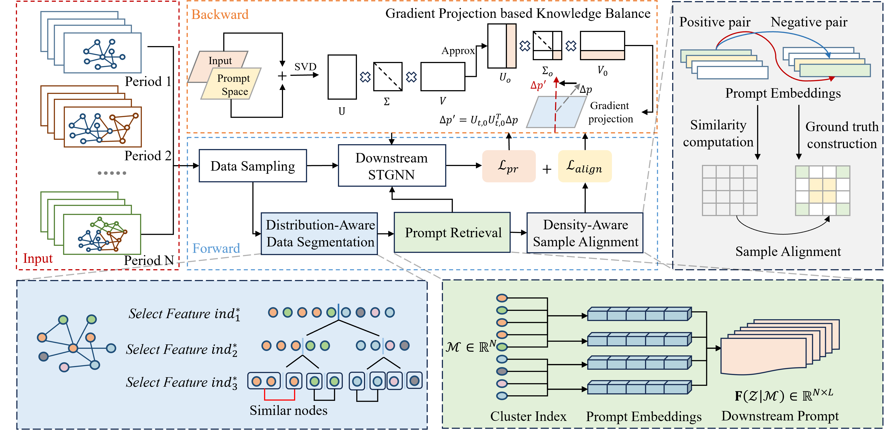

<div align="center" style="font-size:28px;">
  <b>Data-Segmentation Prompt based Continual Learning Framework for Online Spatio-Temporal Prediction (DepCL) </b>
</div>


<div align="center">
  This is a PyTorch implementation of DepC.
</div>

### Introduction

---

> Dynamic spatio-temporal networks face critical challenges, including catastrophic forgetting of historical patterns and the prohibitive cost of retraining on evolving data.   To address these issues, we propose DepCL, a novel data-segmentation prompt–based continual learning framework. DepCL partitions nodes into homogeneous clusters and assigns exclusive, lightweight prompts to each, enabling efficient model adaptation by only retrieving and fine-tuning these prompts.   This partition-and-retrieve paradigm is made robust by a Gradient Projection–based Knowledge Balance mechanism to preserve stability and a Density-Aware Sample Alignment strategy to mitigate representation conflicts from node imbalance.

<p align="center">
    
</p>


### Preparations

---

#### Settings

The model is implemented using Python3 with core dependencies as follows:

```
python=3.7.16
torch=1.13.1
torch-geometric=2.3.1
pandas=1.3.5
numpy=1.21.5
scikit-learn=1.0.2 
```

#### Datasets

Our datasets are also available on [Google Drive](https://drive.google.com/drive/folders/1ap_OTKU3yVpxzFAjgCVZIrXBCah1PnmF?usp=sharing).

#### Project Structure

```
└── DepCL
         ├── conf
			 ├── AIR
			 ├── ENERGY-Wind
			 └── PEMS
         ├── log
         ├── src
         	 ├── dataer
			 ├── model
			 └── trainer
         ├── utils
         ├── main_nature.py
         ├── stkec_main.py
         └── main_revise.py
```


### Model Training

---

You can run a specific method on a specific dataset separately using script as follows:

```
# run DepCL on PEMS-Stream
python main_revise.py --conf conf/PEMS/depcl.json  --method DepCL --gpuid 0 --seed 0
```

